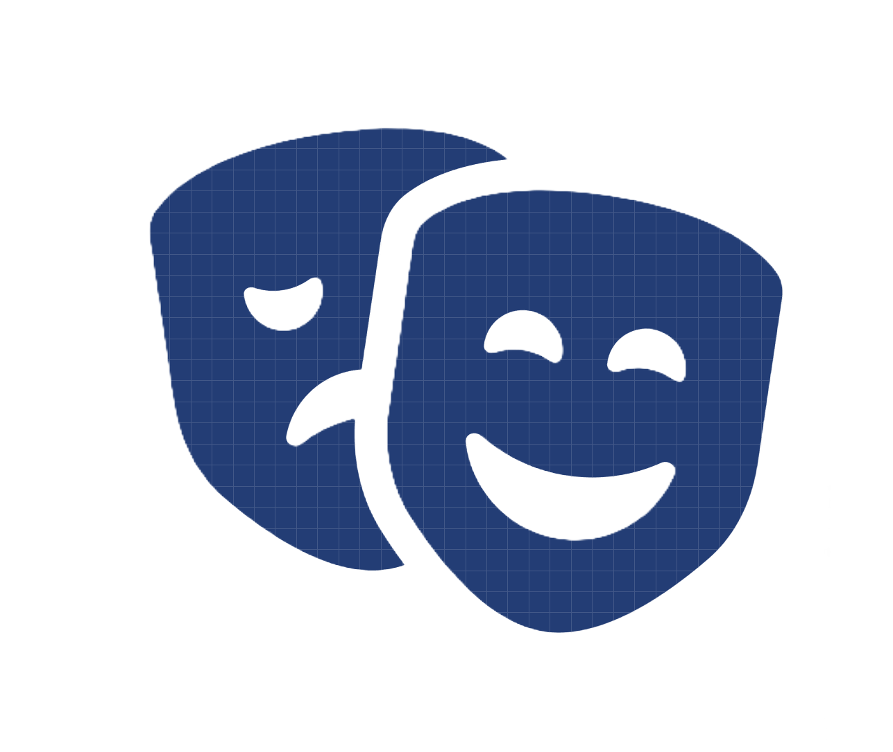

 

  

 
 

<h1 align="center">👾 Imposter 👾</h1>

<h3 align="center"><strong>Guess. Reveal. Win.</strong></h3>

 
  
 

 

## Features

- 🎮 **Host / Join**
- ⚡ **Realtime Multiplayer** 
- 🖼️ **Responsive UI** 
- 🛠️ **Modular Components**
- 🌐 **Plattform-unabhängig**
- 🔒 **Self-host** 

---

## 📜 License

This project is licensed under the [MIT License](LICENSE).

> Add information about the usage if needed. For example,
>
> This software is open source and available under the MIT License. See the [LICENSE](LICENSE) file for more information.
>
> We follow the [Contributor Covenant](CODE_OF_CONDUCT.md).
> Please stick to it so that everyone has fun here. 🙌

💡 *We appreciate all contributions! Feel free to submit a PR or open an issue.* 🎉

  <!-- Badges -->
  <!-- Replace with actual badges -->
  
  
  
  

